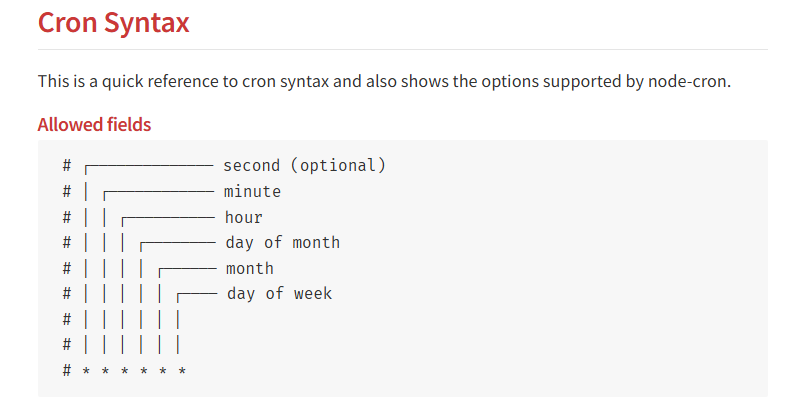
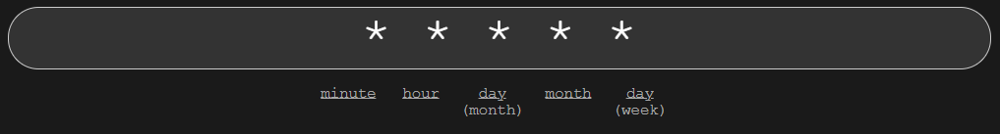

# Scheduling Task

- install cron module: npm i node-cron
- cron job need to run as soon as the application starts

- check https://crontab.guru/
  

- schedule a job
- install date-fns module: npm i date-fns
- find all unique email id who have got connection request previously
- send email
- explore queue mechanism to send bulk mechanism
- explore Amazon SES bulk emails
- make sendEmail function dynamic
- bee-queue npm packages
